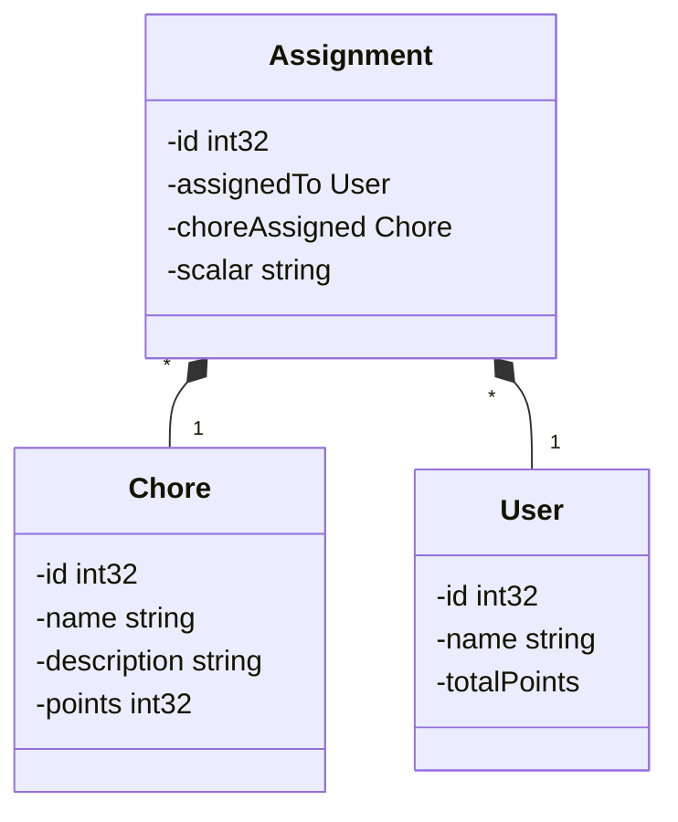

```mermaid
classDiagram
	Assignment "*" *-- "1" Chore
	Assignment "*" *-- "1" User

	class Chore{
		-id int32
		-name string
		-description string
		-points int32
	}

	class Assignment{
		-id int32
		-assignedTo User
		-choreAssigned Chore
		-scalar string
	}

	class User{
		-id int32
		-name string
		-totalPoints
	}
```