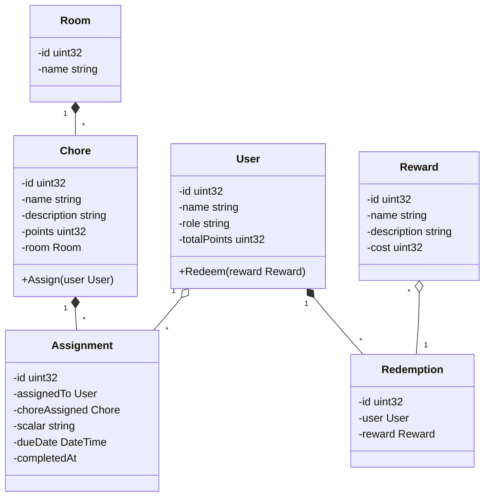

```mermaid
classDiagram
	Chore "1" *-- "*" Assignment
	User "1" o-- "*" Assignment
	User "1" *-- "*" Redemption
	Room "1" *-- "*" Chore
	Reward "*" o-- "1" Redemption

	class Chore{
		-id uint32
		-name string
		-description string
		-points uint32
		-room Room
		+Assign(user User)
	}

	class Room {
		-id uint32
		-name string
	}

	class Assignment{
		-id uint32
		-assignedTo User
		-choreAssigned Chore
		-scalar string
		-dueDate DateTime
		-completedAt 
	}

	class User{
		-id uint32
		-name string
		-role string
		-totalPoints uint32
		+Redeem(reward Reward)
	}

	class Reward{
		-id uint32
		-name string
		-description string
		-cost uint32
	}

	class Redemption{
		-id uint32
		-user User
		-reward Reward
	}
```