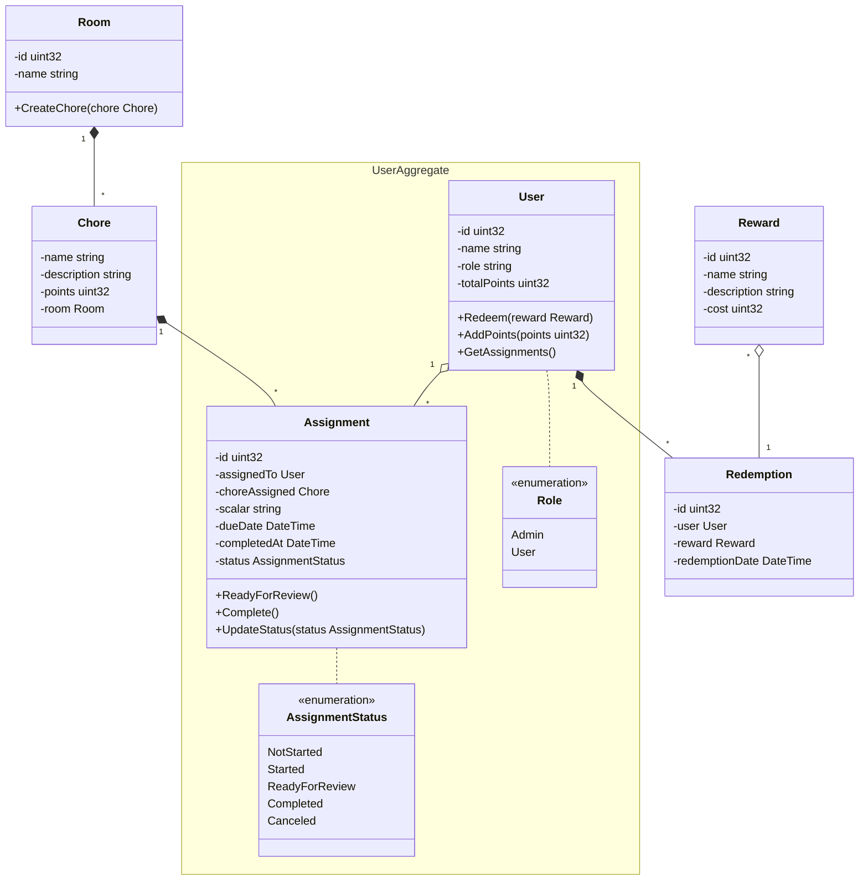

```mermaid
classDiagram
	Chore "1" *-- "*" Assignment
	User "1" o-- "*" Assignment
	User "1" *-- "*" Redemption
	Room "1" *-- "*" Chore
	Reward "*" o-- "1" Redemption
	Assignment .. AssignmentStatus
	User .. Role

	class Chore{
		-name string
		-description string
		-points uint32
		-room Room
	}

	class Room {
		-id uint32
		-name string
		+CreateChore(chore Chore)
	}

	namespace UserAggregate {
		class User{
		-id uint32
		-name string
		-role string
		-totalPoints uint32
		+Redeem(reward Reward)
		+AddPoints(points uint32)
		+GetAssignments()
		}
		class Assignment{
			-id uint32
			-assignedTo User
			-choreAssigned Chore
			-scalar string
			-dueDate DateTime
			-completedAt DateTime
			-status AssignmentStatus
			+ReadyForReview()
			+Complete()
			+UpdateStatus(status AssignmentStatus)
		}
		class Role {
		<<enumeration>>
		Admin
		User
	}

	class AssignmentStatus {
		<<enumeration>>
		NotStarted
		Started
		ReadyForReview
		Completed
		Canceled
	}
	}


	class Reward{
		-id uint32
		-name string
		-description string
		-cost uint32
	}

	class Redemption{
		-id uint32
		-user User
		-reward Reward
		-redemptionDate DateTime
	}
```
